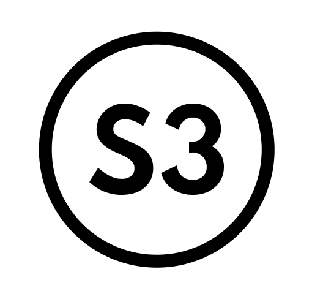

# node-red-contrib-generic-s3




### These node-red nodes are meant to work with any S3 provider while making the workflow easier to follow

Node name  | Detailed information
------------- | -------------
List Buckets  | This node is used for listing all buckets that are available with the configured client
List Objects (Depracted)  | This node is used to list all objects that are within a bucket. The bucket can be specified either directly on this node properties or by setting input property `msg.bucket` \| There are few other added properties to this node from 1.3.2 release such as `Max keys` - Positive integer value up to 1000 that specifies how many keys(objects) can be maximum listed per request. It can also be set by input message property `msg.maxkeys` \| `Marker` - Where you want the listing to start from. The listing starts after this specified key and the marker can be any key in the bucket. It can also be set by input message property `msg.marker` \| `Prefix` - This property limits the response to keys that begin with the specified prefix. It can also be set by input message property `msg.prefix`.
List Objects V2  | This node is used to list all objects that are within a bucket. The bucket can be specified either directly on this node properties or by setting input property `msg.bucket` \| There are few other added properties to this node from 1.3.2 release such as `Max keys` - Positive integer value up to 1000 that specifies how many keys(objects) can be maximum listed per request. It can also be set by input message property `msg.maxkeys` \| `Start after` - Where you want the listing to start from. The listing starts after this specified key and the start after marker can be any key in the bucket. It can also be set by input message property `msg.startafter` \| `Prefix` - This property limits the response to keys that begin with the specified prefix. It can also be set by input message property `msg.prefix` \| `ContinuationToken` - This property indicates that the list is being continued on this bucket with a token. The Continuation Token is obfuscated and is not a real key. It can aslo be set by input message property `msg.continuationtoken` **Please note that we recommend using this node instead of `List Objects`, since that one is depracted and it will be removed with the next major release**
List Object Versions  | This node is used to list all object(s) version(s) that are within a bucket. The bucket can be specified either directly on this node properties or by setting input property `msg.bucket` \| `Max keys` - Positive integer value up to 1000 that specifies how many keys(objects) can be maximum listed per request. It can also be set by input message property `msg.maxkeys`  \| `Key marker` - Where you want the listing to start from. The listing starts after this specified key and the start after marker can be any key in the bucket. It can also be set by input message property `msg.keymarker` \| `Version ID Marker` - This property specifies the object version you want to start listing from. It can also be set by unput message property `msg.versionidmarker` \| `Prefix` - This property limits the response to keys that begin with the specified prefix. It can also be set by input message property `msg.prefix`.
Get Object    | This node is used to get object contents and metadata from the specified bucket using the configured client. The `Bucket`, `Object Key`, `Version ID` and `Stringify body` can be specified in the properties of the node or by setting input properties `msg.bucket`, `msg.key`, `msg.versionid` and `msg.stringifybody` respectively
Head Object   | This node is used to get object metadata from the specified bucket using the configured client while not fetching the object itself. The `Bucket`, `Object Key` and `Version ID` can be specified in the properties of the node or by setting input properties `msg.bucket`, `msg.key` and `msg.versionid` respectively
Create Bucket | This node is used to create bucket with perviously defined S3 client used in the configuration. The bucket name can be specified either directly on the node properties or by setting input property `msg.bucket`
Put Object    | This node is used to create or update object and(or) object's metadata with a specific key within a specified bucket. `Bucket` - The bucket \| `Key` - The object key \| `Content-Type` - Content-Type of the object's data \| `Body` - Actual contents of the object \| `Stream` - (Optional) The provided body is a stream. For streamifying the body contents we recommend [this function](https://github.com/digitalnodecom/node-red-contrib-generic-s3/blob/main/common/common.js#L23-L30) \| `Metadata` - (Optional) Metadata of the object \| `Upsert` - Upserting flag. These values can be specified in the node properites or by setting input properties like the following `msg.bucket` - The bucket \| `msg.key` - The object key \| `msg.contentType` - Content-Type of the object's data \| `msg.body` - Actual contents of the object \| `msg.stream` - (Optional) The provided body is a stream. For streamifying the body contents we recommend [this function](https://github.com/digitalnodecom/node-red-contrib-generic-s3/blob/main/common/common.js#L23-L30) \| `msg.metadata `- (Optional) Metadata of the object \| `msg.upsert` - (Optional) Upsert flag which before inserting compares the ETag(if the object already exists) with calculated MD5 hash of the inserting object body, and if they differ, then the object is updated
Move Object    | This node is used to move an object within one bucket or across different buckets. `Destination Bucket` - The destination bucket where the object is going to be moved \| `Destination Key` - The destination object key \| `Source Bucket` - The source bucket where the object is located that is going to be moved \| `Source Object Key` - The source key of the object that is going to be moved.  These values can be specified in the node properites or by setting input properties like the following `msg.bucket` - The destination bucket where the object is going to be moved \| `msg.key` - The destination object key \| `msg.sourcebucket` - The source bucket where the object is located that is going to be moved \| `msg.sourcekey` -  The source key of the object that is going to be moved.
Put Objects   | This node is used to create or update objects and(or) object's metadata with a specific key within a specified bucket. `Objects` - Array of json objects that have the same format as the objects in **Put Object** node \| `Upsert` - Upserting flag. This value can be specified in the node properites or by setting input properties like the following `msg.objects` - Array of objects that the user wants to create and(or) update in a bucket. The object structure is the same as the one in the Put Object and the same rules apply of it as well \| `msg.upsert` - (Optional) Upsert flag which before inserting compares the ETag(if the object already exists) with calculated MD5 hash of the inserting object body, and if they differ, then the object is updated. This is done for each object in the provided array
Delete Object | This node is used to delete object from a specified bucket. Object's key and the bucket can be specified in the node properites or by setting input properties in `msg.bucket` and(or) `msg.key`
Copy Object   | This node is used to copy object from specified bucket. There are few necesearry paramaters and one optional paramaters for this node. `Bucket` - The bucket \| `Key` - The key of the new object, into the which contents are going to be copied from the object specified in Copy Source \| `Copy Source` - Specifies the source object for the copy operation. You specify the value in one of two formats, depending on whether you want to access the source object through an access point: **`1.`** For objects not accessed through an access point, specify the name of the source bucket and the key of the source object, separated by a slash (/). For example, to copy the object `reports/january.pdf` from the bucket awsexamplebucket, use `awsexamplebucket/reports/january.pdf`. **`2.`** For objects accessed through access points, specify the Amazon Resource Name (ARN) of the object as accessed through the access point, in the format `arn:aws:s3:::accesspoint//object/`. For example, to copy the object **reports/january.pdf** through access point **my-access-point** owned by account 123456789012 in Region **us-west-2**, use the URL encoding of `arn:aws:s3:us-west-2:123456789012:accesspoint/my-access-point/object/reports/january.pdf`. \| `Version ID` (optional) - Specific version of the object that you want to copy. By default the latest version of the object is copied. These values can be specified in the node properites or by setting input properties like the following `msg.bucket` - The bucket \| `msg.key` - The new object key \| `msg.copysource` - The source that the user want to be copied, explained in details aboce \| `msg.versionid` (optional) - Specific version of the object that you want to copy.
client-s3     | Configuration node used in all of the above mentioned nodes to perform the specified operations. Here are few tips for it that will make it much easier to use the node. The S3 endpoint should be an url beggining with `http://` or `https://`. There are fields for `Access Key` and `Key Secret`, and it is recomended that you use environment variables. Environment variables in node-red can be inputted like by enclosing the name of the variable by parentheses and prefixing it with `$`. E.g. `$(nameOfTheVar)`

#### Install these nodes using the following command or directly via node-red dashboard
```bash
npm install node-red-contrib-generic-s3
```
